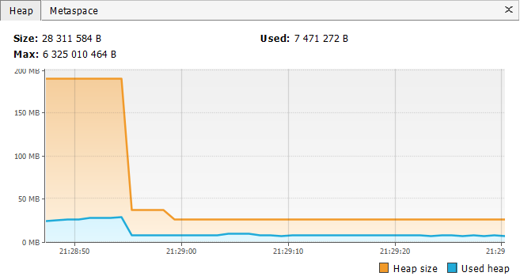

# sprinboot-vs-quarkus

This project compares the start-up time and memory footprint of a basic "Hello Word" Quarkus and a Spring Boot application, 
both running on JVM.

If you want to learn more about Quarkus, please visit its website: https://quarkus.io/ for Spring Boot visit 
https://spring.io/projects/spring-boot website.

## Used technologies

Spring Boot 2.2.2/Quarkus 1.1.1

Java 11

Gradle 6.0.1

## Building and running applications

Build: 
`gradlew clean build`

The applications are runnable using:

`java -jar quarkusexample/build/quarkusexample-0.0.1-SNAPSHOT-runner.jar`

or

`java -jar springbootexample/build/springbootexample-0.0.1-SNAPSHOT.jar`

## Comparing start-up times

## Comparing memory footprint

Java heap monitored by VisualVM 1.4.4: https://visualvm.github.io/

Quarkus memory footprint (after performing garbage collection)

Spring Boot memory footprint (after performing garbage collection)

